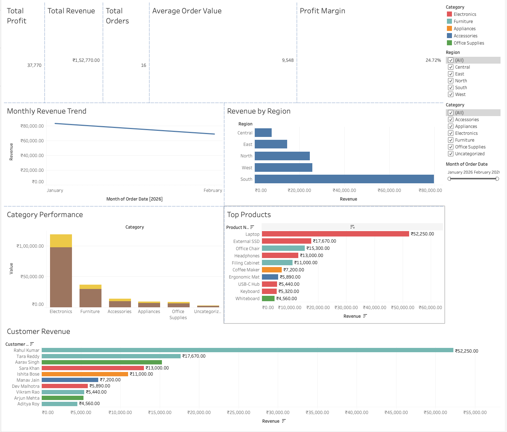

# Sales Analytics Dashboard

An end-to-end portfolio project that turns imperfect e-commerce CSV data into a
validated analytics dataset, stores it in MySQL, and presents business KPIs in
an interactive Tableau dashboard.

## Project flow

`Raw CSV → Python/Pandas profiling and cleaning → MySQL → SQL analysis → Tableau`

## Structure

```text
sales-analytics-dashboard/
├── data/raw/sales_data.csv
├── data/processed/.gitkeep
├── scripts/clean_data.py
├── scripts/load_mysql.py
├── sql/create_tables.sql
├── sql/analysis_queries.sql
├── tableau/sales_analytics_dashboard.twbx
├── screenshots/sales_analytics_dashboard.png
├── requirements.txt
└── .gitignore
```

The raw sample deliberately contains duplicates, mixed date formats, missing
values, inconsistent capitalization, negative quantity/price, an invalid
discount, and an invalid date. The cleaner retains valid repaired records and
writes unrecoverable rows to a separate rejected-data file for auditability.

## Schema and calculations

Each clean row represents one order/product record. Core dimensions are order,
date, customer, region, product, and category. Measures include quantity, unit
price, cost, discount, revenue, profit, and profit margin.

```text
Revenue      = Quantity × Unit_Price × (1 - Discount)
Profit       = Revenue - (Quantity × Cost)
Profit Margin = Profit / Revenue
```

## Setup on macOS

1. Install Python 3.11+ and MySQL Community Server. MySQL Workbench is optional.
2. In Terminal, enter the project folder and create an environment:

   ```bash
   python3 -m venv .venv
   source .venv/bin/activate
   python -m pip install -r requirements.txt
   ```

3. Clean and validate the sample data:

   ```bash
   python scripts/clean_data.py
   ```

Tableau runs natively on macOS. Open the packaged workbook from the `tableau/`
folder to explore or extend the finished dashboard.

## Setup on Windows

1. Install Python 3.11+, MySQL Community Server, MySQL Workbench, and Tableau.
2. In PowerShell, enter the project folder:

   ```powershell
   py -m venv .venv
   .\.venv\Scripts\Activate.ps1
   python -m pip install -r requirements.txt
   python scripts\clean_data.py
   ```

   If script activation is restricted, run
   `Set-ExecutionPolicy -Scope Process Bypass` in that PowerShell window.

## Load MySQL and run the analysis

1. Run `sql/create_tables.sql` in MySQL Workbench or with the MySQL command line.
2. Set your MySQL password only for the current terminal session. Never commit
   the password to source control:

   ```bash
   export MYSQL_PASSWORD='your-password'
   ```
3. Load the cleaned file:

   ```bash
   python scripts/load_mysql.py
   ```

4. Run `sql/analysis_queries.sql` to verify KPIs and aggregations.
5. Open `tableau/sales_analytics_dashboard.twbx` in Tableau to explore the
   dashboard or connect Tableau to the cleaned CSV.

## Dashboard



The dashboard includes executive KPI cards, a monthly revenue trend, regional
and category performance, top-product analysis, customer revenue, and
interactive date, region, and category filters.

## Cleaning and validation performed

- Reports row/column counts, missing values, and duplicates
- Removes exact duplicate rows and trims text
- Standardizes region capitalization
- Fills missing customer/category labels and missing discounts
- Parses mixed dates and converts numeric columns safely
- Rejects invalid IDs, dates, quantities, prices, costs, and discounts
- Calculates and validates Revenue, Profit, and Profit_Margin
- Writes both clean and rejected CSV outputs

## Next steps

- Replace the sample with a larger public retail dataset
- Add automated tests for the cleaning and loading pipeline
- Normalize the single sales table into customers, products, orders, and items
- Add automated data-quality tests and incremental loading
- Publish the Tableau workbook to Tableau Public
- Add a project findings section with resume-ready business insights
